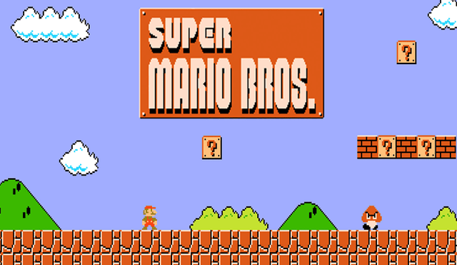

# Super Mario Web

El objetivo de este ejercicio, es crear una pantalla como la de la imagen img/resultado.png en formato web con divs y imagenes, colocadas en el sitio más exacto posible con position:absolute.

La pantalla tiene que medir 900px de ancho y los que consideréis de alto.

Intentad replicar lo mejor posible la imagen resultado.png sin usar, por supuesto la imagen resultado.png.

Las cajas y algunos elementos, tienen una pequeña sombra. Intentad replicarla con CSS.

Haced alguna animación con el cartel, el SuperMario o con lo que queráis con los recursos web vistos en clase.

# Entrega

Entregar la tarea, a ser posible en github. Sino, entregar la tarea en un ZIP por la moodle con el nombre:

ApellidosNombre_SuperMarioWeb.zip.

